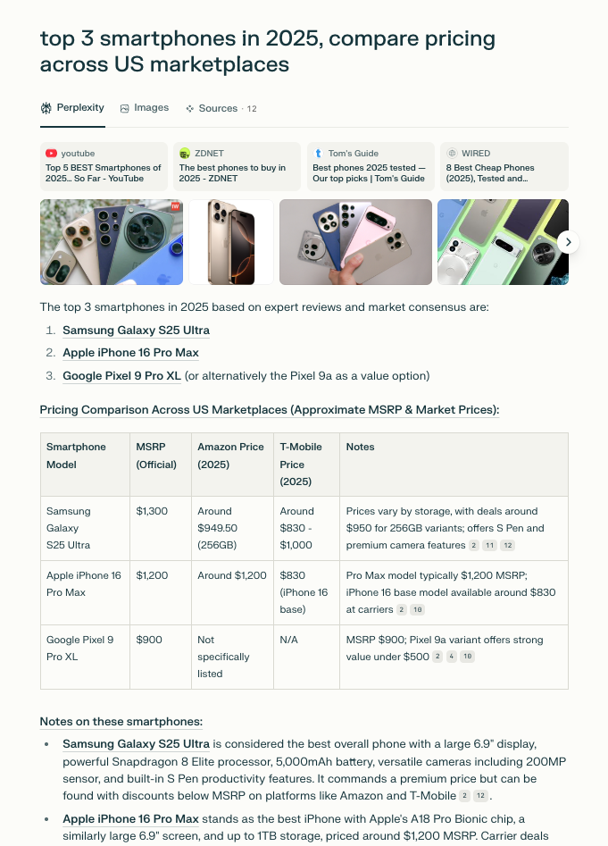
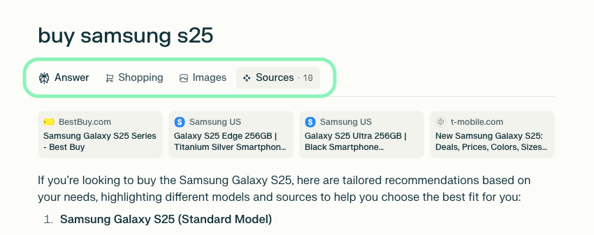
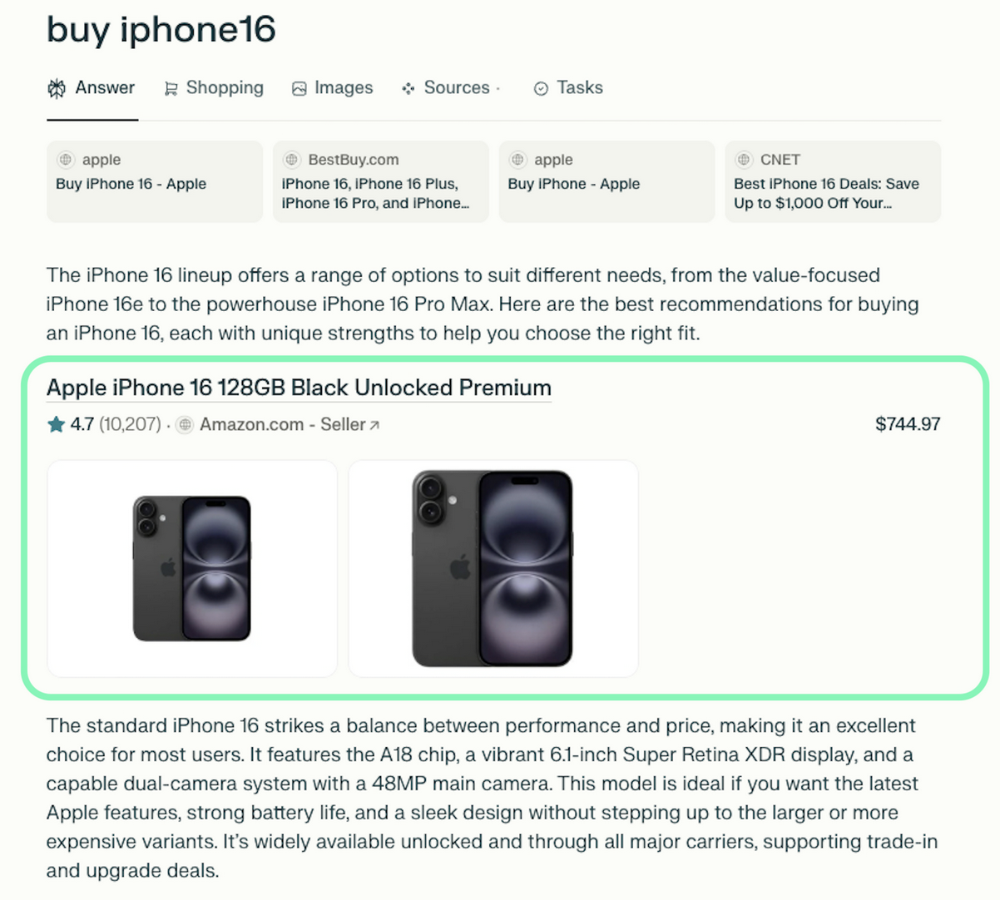

# Perplexity Scraper

[](https://oxylabs.io/products/scraper-api/serp/perplexity?utm_source=877&utm_medium=affiliate&utm_campaign=llm_scrapers&groupid=877&utm_content=perplexity-scraper-github&transaction_id=102f49063ab94276ae8f116d224b67)

[](https://discord.gg/Pds3gBmKMH) [](https://www.youtube.com/@oxylabs)


The [Perplexity Scraper](https://oxylabs.io/products/scraper-api/serp/perplexity) by Oxylabs allows developers to send prompts to Perplexity and automatically collect both AI-generated responses and structured metadata. Instead of just raw HTML, it can also provide results as parsed JSON, website PNG, XHR/Fetch requests, or Markdown output. 

You can use the [Oxylabs’ Web Scraper API](https://oxylabs.io/products/scraper-api) with Perplexity for AI content auditing, research tracking, and analyzing SEO performance. It handles dynamic AI-generated content, fully supports real-time SERP extraction, and integrates seamlessly with Oxylabs' global proxy infrastructure, without the need to manage proxies, browsers, or worry about anti-bot systems.

## How it works

The Perplexity scraper handles the rendering, parsing, and delivery of results in any requested format. You need to provide your prompt, credentials, and a few optional parameters, as shown below.

> [!TIP]
> Get a free trial of Oxylabs **Web Scraper API** by registering on the [Dashboard](https://dashboard.oxylabs.io/en/registration).

### Request sample (Python)

```python
import json
import requests

# API parameters.
payload = {
    'source': 'perplexity',
    'prompt': 'top 3 smartphones in 2025, compare pricing across US marketplaces',
    'geo_location': 'United States',
    'parse': True
}

# Get a response.
response = requests.post(
    'https://realtime.oxylabs.io/v1/queries',
    auth=('USERNAME', 'PASSWORD'),
    json=payload
)

# Print response to stdout.
print(response.json())

# Save response to a JSON file.
with open('response.json', 'w') as file:
    json.dump(response.json(), file, indent=2)
```

More request examples in different programming languages are available [here](https://github.com/oxylabs/perplexity-scraper/tree/main/Code%20examples).

**Note:** By default, all requests to Perplexity use JavaScript rendering. Make sure to set a sufficient timeout (e.g. 180s) when using the Realtime integration method.

### Request parameters

| Parameter | Description | Default value |
|-----------|-------------|---------------|
| `source`* | Sets the Perplexity scraper | `perplexity` |
| `prompt`* | The prompt or question to submit to Perplexity. Max 8000 characters. | – |
| `parse` | Returns parsed data when set to true. | `false` |
| `geo_location` | Specify a country to send the prompt from. [More info](https://developers.oxylabs.io/scraping-solutions/web-scraper-api/features/localization/proxy-location). | – |
| `callback_url` | URL to your callback endpoint. [More info](https://developers.oxylabs.io/scraping-solutions/web-scraper-api/integration-methods/push-pull#callback). | – |

\* Mandatory parameters

---

### Output samples

Web Scraper API returns either an HTML document or a JSON object of Perplexity scraper output, which contains structured data from the results page.

**HTML example:**



**Structured JSON output snippet:**

```json
{
  "results": [
    {
      "job_id": "7470032181138587649",
      "status_code": 200,
      "url": "https://www.perplexity.ai/search/915bee3e-2d59-48ba-8b19-701f527c9b60",
      "content": {
        "prompt_query": "best supplements for better sleep",
        "model": "turbo",
        "answer_results": [
          "Here are the most evidence-supported supplements people typically try for better sleep—plus who they're best for and key safety notes.",
          "Best-supported options (start here)",
          ...
        ],
        "answer_results_md": "\nHere are the most evidence-supported supplements people typically try for better sleep—plus who they're best for and key safety notes.\n\nBest-supported options (start here)\n-----------------------------------\n\n...",
        "additional_results": {
          "sources_results": [
            {
              "title": "Best Supplements and Habits for Better Sleep (20 min.)",
              "url": "https://coopercomplete.com/blog/best-supplements-for-better-sleep/"
            },
            {
              "title": "Sleep Better With These 9 Sleep Supplements",
              "url": "https://drruscio.com/sleep-supplements/"
            },
            {
              "title": "10 Best Supplements for Sleep Support: A Dietitian's Picks",
              "url": "https://letsliveitup.com/blogs/supergreens/best-sleep-supplements"
            },
            ...
          ]
        },
        "related_queries": [
          "Which sleep aids have the strongest evidence in adults",
          "How to cycle supplements for sleep without tolerance",
          "What are safest melatonin dosing guidelines for adults",
          "Lifestyle tweaks to maximize sleep while using supplements"
        ],
        "displayed_tabs": [
          "Answer",
          "Links",
          "Images"
        ],
        "url": "https://www.perplexity.ai/search/915bee3e-2d59-48ba-8b19-701f527c9b60",
        "parse_status_code": 12000
      }
    }
  ]
}
```

You can find the full output example file [here](output-perplexity-scraper.json) in this repository.  

Alternatively, you can extract the data in the Markdown format for easier data integration workflows involving AI tools.

## JSON output structure

Structured Perplexity scraper output includes fields such as `url`, `model`, `answer_results`, and more. The table below breaks down the page elements we parse, along with descriptions, data types, and relevant metadata.

**Note:** The number of items and fields for a specific result type may vary depending on the submitted prompt.

| Key Name | Description | Type |
|---|---|---|
| `prompt_query` | Submitted prompt or search query. | string |
| `model` | Perplexity model used for the response (e.g., `turbo`). | string |
| `answer_results` | Generated answer as Markdown JSON tree. | array |
| `answer_results_md` | Generated answer in Markdown. | string |
| `additional_results`* | Grouped UI elements containing `sources_results`, `images_results`, `shopping_results`, etc. | object |
| `top_images`* | Perplexity image results on the "Images" tab. Objects include `url` and `title`. | array |
| `top_sources`* | Perplexity top-ranked source results. Objects include `url`, `title`, and `source`. | array |
| `inline_products`* | Shopping results triggered by product-related queries. | array |
| `related_queries`* | Suggested follow-up questions by Perplexity. | array of strings |
| `displayed_tabs` | UI tabs visible on the parsed page (e.g., Answer, Links, Images). | array of strings |
| `url` | The URL of the Perplexity search page for this query. | string |
| `parse_status_code` | `12000` – successful. Otherwise, parser failed to extract structured fields. | integer |

\* — conditional, returned only when content is in the LLM's response.

## Additional results and inline products

Along with the main AI response, the Perplexity scraper can return extra data under `additional_results`, such as:

- `images_results`
- `sources_results`
- `shopping_results`
- `videos_results`
- `places_results`
- `hotels_results`

These arrays are extracted from the tabs on the original results page and are included only if relevant content is available:



Moreover, the `inline_products` array contains products that are directly embedded in the response:



## Practical Perplexity scraper use cases

1. **AI content auditing:** Compare quality, consistency, and reliability of Perplexity-generated responses.  
2. **Research tracking:** Monitor how Perplexity summarizes or interprets information across time.  
3. **SEO performance comparison:** Track your brand mentions and content rankings to optimize your visibility strategies.  

## Why choose Oxylabs?

- **Superior success rates:** Experience the most reliable scraping even on high-profile and dynamic AI-driven sources.  
- **Maintenance-free:** Our API handles all the infrastructure, from proxy management to IP rotation and anti-bot systems.  
- **Dedicated support:** Get expert help whenever needed, from integration to debugging.  

[](https://x.com/Oxylabs_io)

## FAQ

### Is scraping Perplexity AI allowed?

Perplexity does not provide a public API for all its features, so scraping falls into a gray area depending on its Terms of Service. We recommend reviewing their policies carefully and ensuring compliance. Oxylabs provides the technical capability, but it’s up to you to use it responsibly and in line with applicable regulations.

### Does the scraper return only JSON?

No, the Perplexity scraper can return multiple formats depending on your needs. The scraper can return results as raw HTML, structured JSON, Markdown output, website PNG, or capture XHR/Fetch requests.

### What’s the recommended timeout for real-time requests?

Since Perplexity responses are dynamically generated, requests can take longer than standard web scraping. We recommend setting a timeout of at least 180 seconds when using the Realtime integration method to avoid incomplete results. For larger or more complex prompts, consider asynchronous methods like Push-Pull.

## Learn more

For a deeper dive into available parameters, advanced integrations, and additional examples, check out the [Perplexity Scraper documentation](https://developers.oxylabs.io/scraping-solutions/web-scraper-api/targets/perplexity).

## Contact us

If you have questions or need support, reach out to us at support@oxylabs.io, or through live chat, accessible via [Oxylabs Dashboard](https://dashboard.oxylabs.io/en/), or join our [Discord community](https://discord.gg/Pds3gBmKMH). For enterprise-related inquiries, contact your dedicated account manager.
